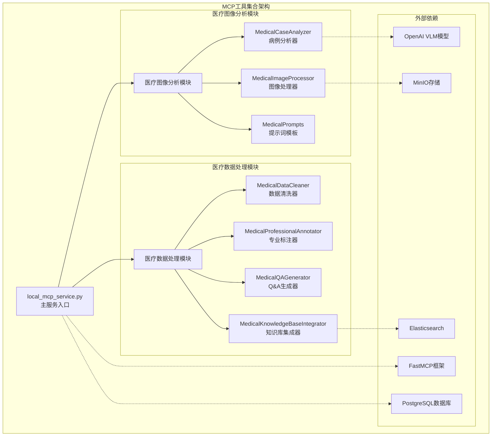
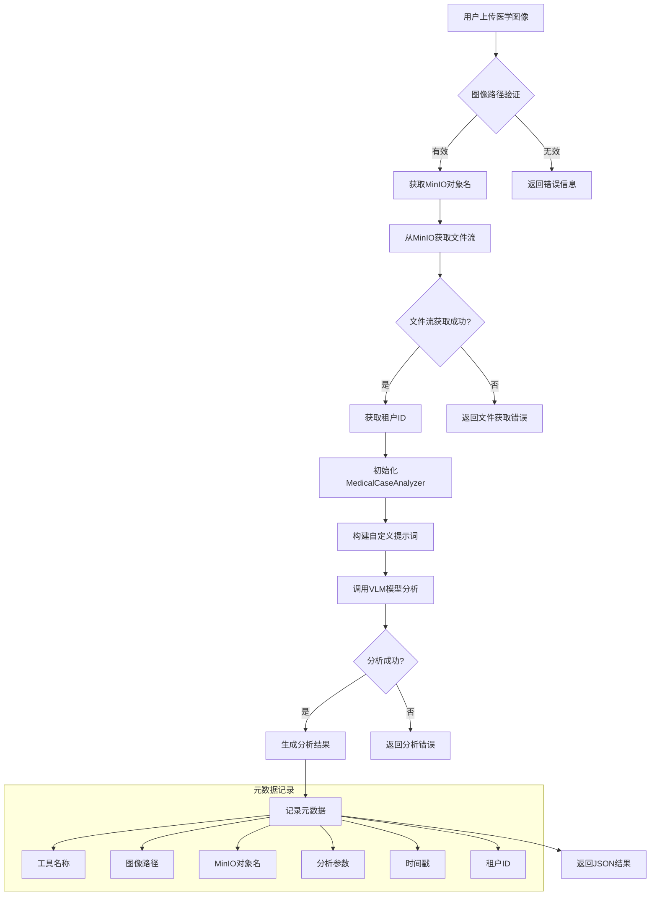
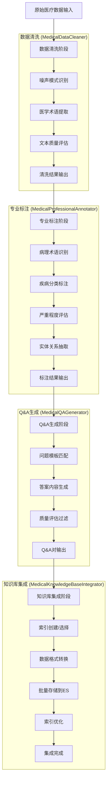
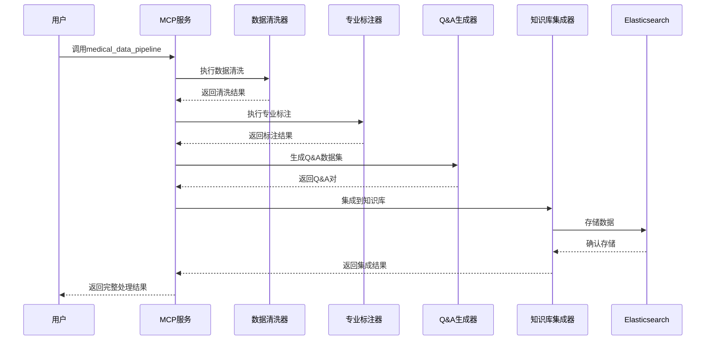

# MCP工具集合详细分析文档

## 📋 目录
- [概述](#概述)
- [整体架构](#整体架构)
- [文件结构分析](#文件结构分析)
- [核心组件详解](#核心组件详解)
- [工具流程图](#工具流程图)
- [数据流分析](#数据流分析)
- [技术实现细节](#技术实现细节)
- [使用场景](#使用场景)

## 🎯 概述

MCP（Model Context Protocol）工具集合是Nexent平台中专门用于医疗数据处理和分析的核心模块。该模块基于FastMCP框架构建，提供了一套完整的医疗AI工具链，涵盖图像分析、数据处理、知识库集成等功能。

### 核心特性
- 🏥 **医疗专业化**: 专门针对医疗领域设计的AI工具
- 🔄 **流水线处理**: 支持数据清洗→标注→Q&A生成的完整流程
- 🖼️ **图像分析**: 专业的医学图像分析能力
- 📚 **知识库集成**: 与Elasticsearch知识库无缝集成
- 🛠️ **模块化设计**: 高度模块化，易于扩展和维护

## 🏗️ 整体架构



## 📁 文件结构分析

```
backend/tool_collection/mcp/
├── local_mcp_service.py          # 主服务文件，定义所有MCP工具
├── medical_data_processing/       # 医疗数据处理模块
│   ├── __init__.py
│   ├── data_cleaner.py           # 数据清洗器
│   ├── demo_processor.py         # 演示处理器
│   ├── knowledge_annotator.py    # 知识标注器
│   ├── knowledge_base_integrator.py # 知识库集成器
│   ├── pathology_processor.py    # 病理学处理器
│   ├── professional_annotator.py # 专业标注器
│   └── qa_generator.py          # Q&A生成器
└── medical_image_analysis/       # 医疗图像分析模块
    ├── __init__.py
    ├── case_analyzer.py         # 病例分析器
    ├── image_processor.py       # 图像处理器
    └── medical_prompts.py       # 医疗提示词模板
```

### 文件职责说明

| 文件 | 主要职责 | 核心功能 |
|------|----------|----------|
| `local_mcp_service.py` | MCP服务主入口 | 定义6个核心工具，处理工具调用逻辑 |
| `case_analyzer.py` | 医疗病例分析 | VLM模型集成，图像分析，结果生成 |
| `image_processor.py` | 图像处理 | 图像验证，格式转换，MinIO集成 |
| `data_cleaner.py` | 数据清洗 | 医疗文本清洗，噪声去除，术语提取 |
| `professional_annotator.py` | 专业标注 | 病理术语标注，疾病分类，严重程度评估 |
| `qa_generator.py` | Q&A生成 | 问答对生成，模板匹配，质量控制 |
| `knowledge_base_integrator.py` | 知识库集成 | Elasticsearch操作，索引管理，搜索功能 |

## 🔧 核心组件详解

### 1. MCP工具定义 (local_mcp_service.py)

该文件定义了6个核心MCP工具：

#### 🩺 breast_histology_analyzer
- **功能**: 乳腺组织学显微镜图像分析
- **输入**: 图像路径、放大倍数、染色方法、临床信息
- **输出**: JSON格式的病理学分析结果
- **特点**: 支持MinIO存储，集成VLM模型

#### 🧹 medical_data_cleaner
- **功能**: 医疗数据清洗
- **输入**: 文本内容、文件路径或批量文件路径
- **输出**: 清洗后的医疗数据和提取的术语
- **特点**: 支持批量处理，专业医学术语识别

#### 🏷️ medical_professional_annotator
- **功能**: 医疗专业标注
- **输入**: 清洗后的内容、内容类型
- **输出**: 标注后的医疗数据
- **特点**: 病理学术语标注，疾病分类

#### ❓ medical_qa_generator
- **功能**: 医疗Q&A数据集生成
- **输入**: 标注后的内容、Q&A数量
- **输出**: 高质量的问答对数据集
- **特点**: 多种问题模板，智能答案生成

#### 🔄 medical_data_pipeline
- **功能**: 医疗数据工程流水线
- **输入**: 原始内容、文件路径、参数配置
- **输出**: 完整处理后的数据集
- **特点**: 一站式处理，集成所有步骤

#### 📚 medical_knowledge_base_integrator
- **功能**: 医疗知识库集成
- **输入**: 操作类型、索引名称、数据集、查询参数
- **输出**: 操作结果或搜索结果
- **特点**: Elasticsearch集成，多种搜索模式

### 2. 医疗图像分析模块

#### MedicalCaseAnalyzer (case_analyzer.py)
```python
class MedicalCaseAnalyzer:
    """医疗病例分析器"""
    
    def __init__(self, tenant_id: str = None):
        self.tenant_id = tenant_id
        self.image_processor = MedicalImageProcessor()
        self.observer = MessageObserver()
        self.vlm_model = None
```

**核心功能**:
- VLM模型初始化和配置管理
- 图像流分析处理
- 结果格式化和时间戳生成
- 错误处理和日志记录

#### MedicalImageProcessor (image_processor.py)
```python
class MedicalImageProcessor:
    """医学图像处理工具类，支持本地文件和 MinIO 存储"""
    
    def __init__(self):
        self.supported_formats = ['.jpg', '.jpeg', '.png', '.bmp', '.tiff', '.dcm']
        self.max_image_size = (2048, 2048)
```

**核心功能**:
- 图像格式验证和转换
- MinIO存储集成
- 图像预处理和优化
- Base64编码支持

### 3. 医疗数据处理模块

#### MedicalDataCleaner (data_cleaner.py)
```python
class MedicalDataCleaner:
    """医疗数据清洗器"""
    
    def __init__(self):
        self.medical_patterns = {
            'diseases': r'(?:癌|肿瘤|炎|症|病|综合征|缺陷|畸形|损伤|破裂|出血|梗死|坏死)',
            'anatomy': r'(?:心脏|肺|肝|肾|脑|胃|肠|骨|肌肉|神经|血管|淋巴)',
            # ... 更多模式
        }
```

**核心功能**:
- 医学术语正则表达式匹配
- 噪声模式识别和清理
- 文本质量评估
- 批量文件处理

#### MedicalProfessionalAnnotator (professional_annotator.py)
```python
class MedicalProfessionalAnnotator:
    """医疗专业标注器"""
    
    def __init__(self):
        self.pathology_terms = {
            '肿瘤分类': {
                '良性肿瘤': ['腺瘤', '纤维瘤', '脂肪瘤'],
                '恶性肿瘤': ['癌', '肉瘤', '白血病'],
                # ... 更多分类
            }
        }
```

**核心功能**:
- 病理学术语词典管理
- 疾病分类和标注
- 严重程度评估
- 实体识别和关系抽取

## 🔄 工具流程图

### 医疗图像分析流程


### 医疗数据处理流水线


### 完整工具调用流程


## 📊 数据流分析

### 数据输入类型
1. **图像数据**: 医学显微镜图像、病理切片
2. **文本数据**: 医疗文档、病理报告、教科书内容
3. **结构化数据**: 标注后的医疗数据、Q&A数据集

### 数据处理流程


### 数据输出格式
- **JSON格式**: 所有工具统一返回JSON格式结果
- **结构化字段**: success、data、error、timestamp等标准字段
- **元数据记录**: 完整的处理过程元数据

## 🛠️ 技术实现细节

### FastMCP集成
```python
# MCP服务初始化
local_mcp_service = FastMCP("local")

# 工具装饰器使用
@local_mcp_service.tool(name="tool_name", description="工具描述")
async def tool_function(param1: str, param2: int = 10) -> str:
    # 工具实现逻辑
    return json.dumps(result, ensure_ascii=False, indent=2)
```

### 错误处理机制
- **统一异常处理**: 所有工具都有完整的try-catch机制
- **错误信息标准化**: 统一的错误返回格式
- **日志记录**: 详细的调试和错误日志
- **优雅降级**: 部分功能失败时的备选方案

### 配置管理
- **租户配置**: 支持多租户的配置管理
- **模型配置**: VLM模型的动态配置
- **参数验证**: 输入参数的严格验证

### 性能优化
- **异步处理**: 所有工具都支持异步调用
- **流式处理**: 大文件的流式读取和处理
- **缓存机制**: 重复数据的缓存优化
- **批量操作**: 支持批量文件处理

## 🎯 使用场景

### 1. 医学教育
- **病理学习**: 病理切片的智能分析和解释
- **案例研究**: 医学案例的自动化分析
- **知识问答**: 医学知识的问答系统构建

### 2. 临床辅助
- **诊断支持**: 病理图像的辅助诊断
- **报告生成**: 自动化病理报告生成
- **质量控制**: 诊断结果的质量评估

### 3. 研究应用
- **数据挖掘**: 医疗文献的数据挖掘
- **知识图谱**: 医学知识图谱构建
- **模型训练**: AI模型的训练数据准备

### 4. 数据处理
- **文档处理**: 医疗文档的批量处理
- **数据清洗**: 医疗数据的标准化清洗
- **格式转换**: 不同格式间的数据转换

## 📈 扩展性设计

### 模块化架构
- **独立模块**: 每个功能模块都可以独立使用
- **接口标准**: 统一的接口设计便于扩展
- **插件机制**: 支持新工具的插件式添加

### 配置驱动
- **参数化配置**: 关键参数都可以通过配置调整
- **模板系统**: 提示词和规则的模板化管理
- **动态加载**: 配置的动态加载和更新

### 集成能力
- **多模型支持**: 支持不同的AI模型集成
- **多存储后端**: 支持不同的存储系统
- **API标准**: 遵循标准的API设计规范

## 🔒 安全性考虑

### 数据安全
- **敏感信息处理**: 医疗数据的脱敏处理
- **访问控制**: 基于租户的访问控制
- **审计日志**: 完整的操作审计记录

### 模型安全
- **输入验证**: 严格的输入参数验证
- **输出过滤**: 敏感信息的输出过滤
- **错误处理**: 安全的错误信息处理

### 合规性
- **医疗法规**: 符合医疗数据处理法规
- **隐私保护**: 用户隐私的严格保护
- **免责声明**: 明确的医疗免责声明

---

*本文档详细分析了MCP工具集合的架构、实现和使用方法，为开发者和用户提供了全面的技术参考。*