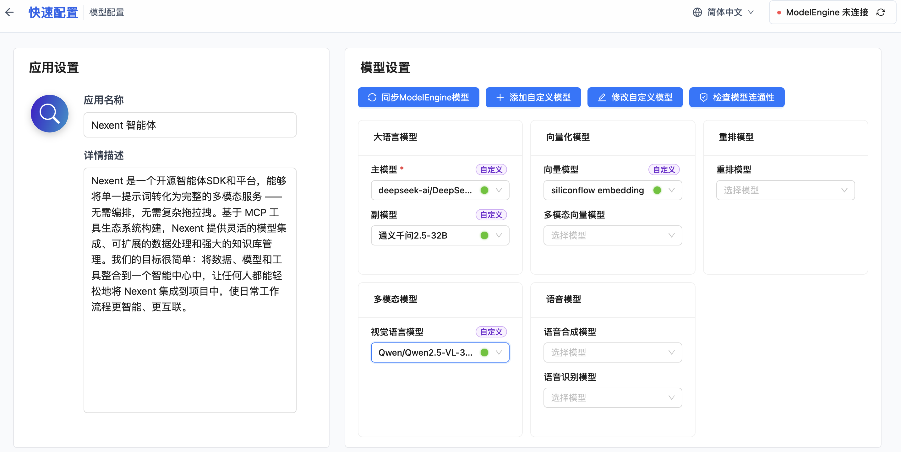
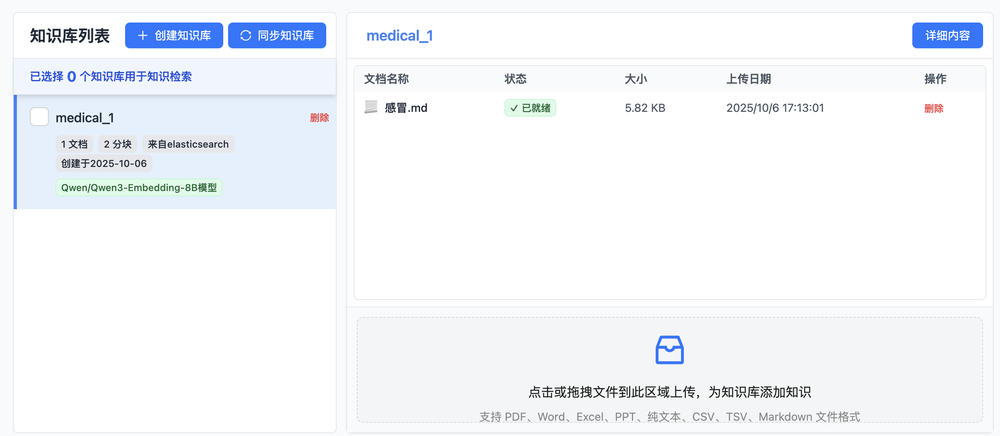
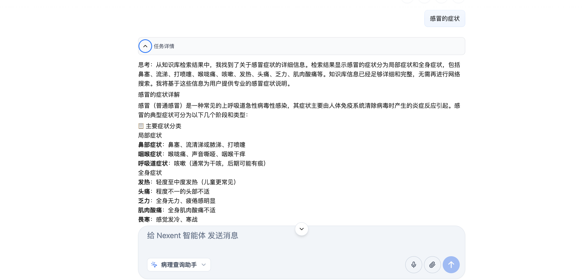

## UI界面下拉列表中选择好我们注册的大模型后进入下一步


## 创建知识库"medical_1",上传文件[感冒.MD](files/感冒.md)


可以看到知识库中有了一个文档"感冒.md",
这个文档就是用我们之前注册的向量模型(embedding)去解析的,我们注册的是 "Qwen/Qwen3-Embedding-8B"
可以看到知识库""medical_1"的描述中也写明了使用的是"Qwen/Qwen3-Embedding-8B"模型.

这一步需要手动处理,可以分多次上传多个文件到本地知识库.

## 创建智能体

### 描述 Agent 应该如何工作,
```
你是一名资深的病理学专家。
你需要查询本地知识库"medical_1"回答问题,
你的回答必须专业、准确，对于不确定的信息，应明确告知‘根据现有知识无法确定’，严禁胡编乱造。
```
### 生成 Agent
选择内置的 本地工具->knowledge_base_search, 这是一个本地库的搜索工具.
点击"生成智能体" 保存智能体. (可选)修改智能体名字为"病理查询助手"


### 使用智能体简单问答

