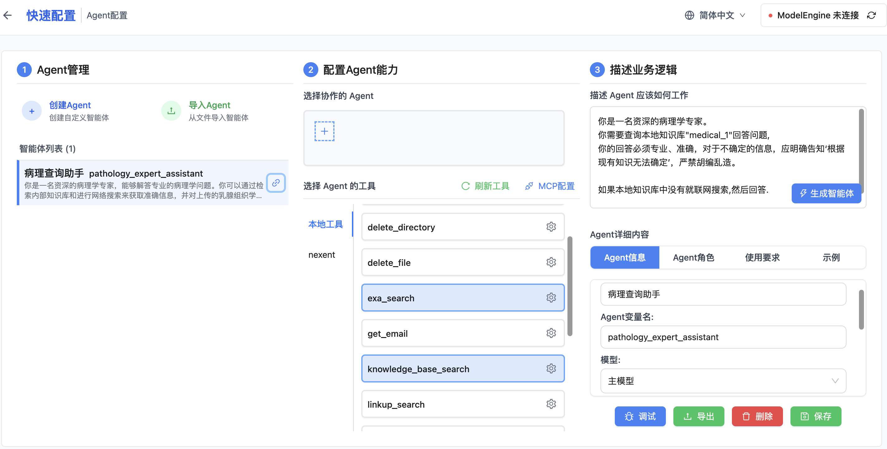

## 修改智能体"描述业务逻辑"



### 描述 Agent 应该如何工作
增加如果本地知识库没有就联网查找的功能.

```
你是一名资深的病理学专家。
你需要查询本地知识库"medical_1"回答问题,
你的回答必须专业、准确，对于不确定的信息，应明确告知‘根据现有知识无法确定’，严禁胡编乱造。

如果本地知识库中没有就联网搜索,然后回答.
```

需要选中"exa_search" 工具,在工具的设置界面输入EXA API key
从这里申请key https://dashboard.exa.ai/api-keys


### 使用智能体简单问答
输入本地知识库中没有的信息,比如"肝癌的症状",
可以看到智能体从本地知识库中没有找到相关信息,然后联网搜索.

