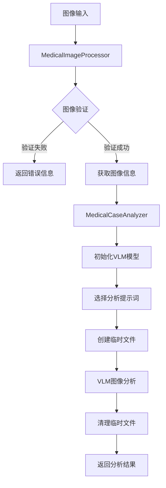
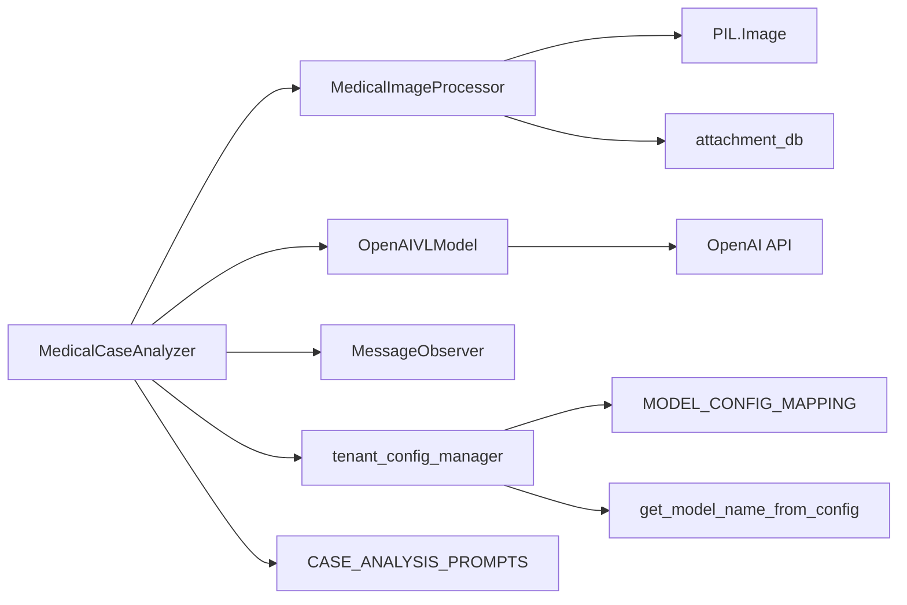

# 医学图像分析工具文档

## 概述

医学图像分析工具是一个专门用于分析医学图像（特别是乳腺组织学显微镜图像）的智能分析系统。该工具集成了视觉语言模型（VLM）和专业的医学图像处理能力，为医学研究和教育提供辅助分析功能。

## 系统架构

### 代码目录
tool_collection/mcp/medical_image_analysis

### 核心组件

1. **MedicalCaseAnalyzer** - 医疗病例分析器
2. **MedicalImageProcessor** - 医学图像处理器  
3. **医学提示词模板** - 专业的病理学分析提示词

### 数据流程图



### 调用关系图



## 核心类详解

### MedicalCaseAnalyzer

医疗病例分析器是系统的核心组件，负责协调整个分析流程。

#### 主要功能
- 初始化和管理VLM模型
- 协调图像处理和分析流程
- 管理分析提示词和配置

#### 关键方法

```python
def __init__(self, tenant_id: str = None)
```
- **功能**: 初始化分析器
- **参数**: `tenant_id` - 租户ID，用于获取模型配置

```python
def _init_vlm_model(self)
```
- **功能**: 初始化视觉语言模型
- **依赖**: `tenant_config_manager`, `OpenAIVLModel`
- **配置**: 从租户配置中获取VLM模型参数

```python
def analyze_medical_image_from_stream(self, image_stream, analysis_type, custom_prompt)
```
- **功能**: 从图像流分析医学图像
- **参数**: 
  - `image_stream`: 图像数据流
  - `analysis_type`: 分析类型
  - `custom_prompt`: 自定义提示词
- **返回**: 包含分析结果的字典

### MedicalImageProcessor

医学图像处理器负责图像的验证、格式转换和基本信息提取。

#### 支持的图像格式
- JPEG (.jpg, .jpeg)
- PNG (.png)
- BMP (.bmp)
- TIFF (.tiff)
- DICOM (.dcm)

#### 关键方法

```python
def validate_image_stream(self, image_stream: io.BytesIO) -> bool
```
- **功能**: 验证图像流的有效性
- **检查项**: 格式支持性、图像尺寸限制

```python
def get_image_info_from_stream(self, image_stream: io.BytesIO) -> Dict[str, Any]
```
- **功能**: 从图像流提取基本信息
- **返回**: 包含格式、尺寸、模式等信息的字典

### 医学提示词模板

系统提供了专业的医学分析提示词模板，针对不同的分析需求：

#### 分析类型

1. **general_analysis** - 通用分析
   - 适用于一般医学图像分析
   - 提供基础的病理学观察

2. **breast_histology_analysis** - 乳腺组织学分析
   - 专门针对乳腺组织学显微镜图像
   - 包含详细的组织学特征分析要求

#### 安全声明

所有分析结果都包含医疗安全声明，强调：
- 仅供医学教育和参考用途
- 不能替代专业医生诊断
- 紧急情况需立即就医

## 技术依赖

### 核心依赖

1. **nexent.core.models.openai_vlm.OpenAIVLModel**
   - 视觉语言模型核心
   - 提供图像分析能力

2. **nexent.core.utils.observer.MessageObserver**
   - 消息观察器
   - 用于模型通信监控

3. **utils.config_utils.tenant_config_manager**
   - 租户配置管理器
   - 获取模型配置信息

4. **PIL (Python Imaging Library)**
   - 图像处理基础库
   - 支持多种图像格式
