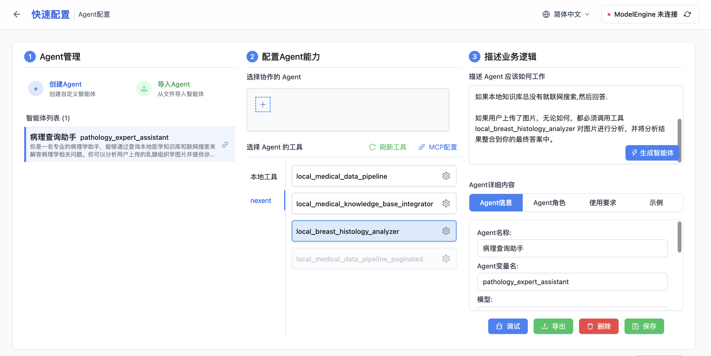
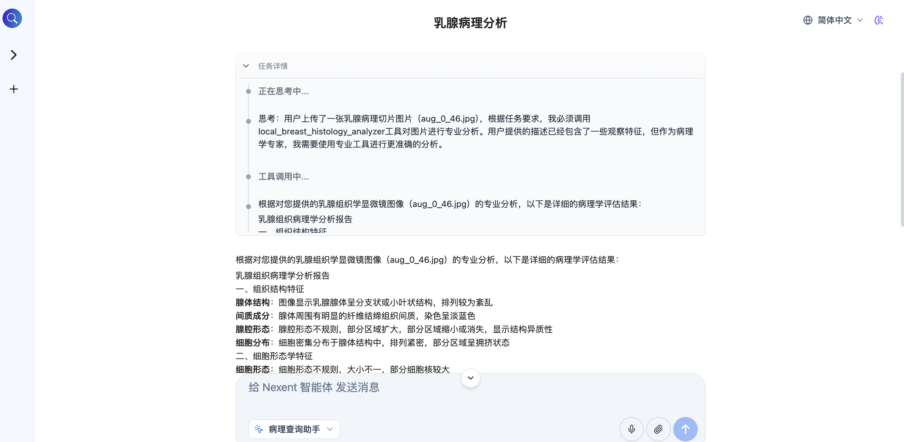

## 配置智能体添加新功能


### 修改我们的"病理查询助手"智能体

描述 Agent 应该如何工作
```
你是一名资深的病理学专家。
你需要查询本地知识库"medical_1"回答问题,
你的回答必须专业、准确，对于不确定的信息，应明确告知‘根据现有知识无法确定’，严禁胡编乱造。

如果本地知识库总没有就联网搜索,然后回答.

如果用户上传了图片，无论如何，都必须调用工具 local_breast_histology_analyzer 对图片进行分析，并将分析结果整合到你的最终答案中。
```
在描述中增加了对图片的分析要求.

local_breast_histology_analyzer 是我们在步骤5中创建的视觉智能体。

在选择 Agent 的工具页面中需要选中 nextent-> local_breast_histology_analyzer

生成智能体.

### 测试智能体医学图像问答
