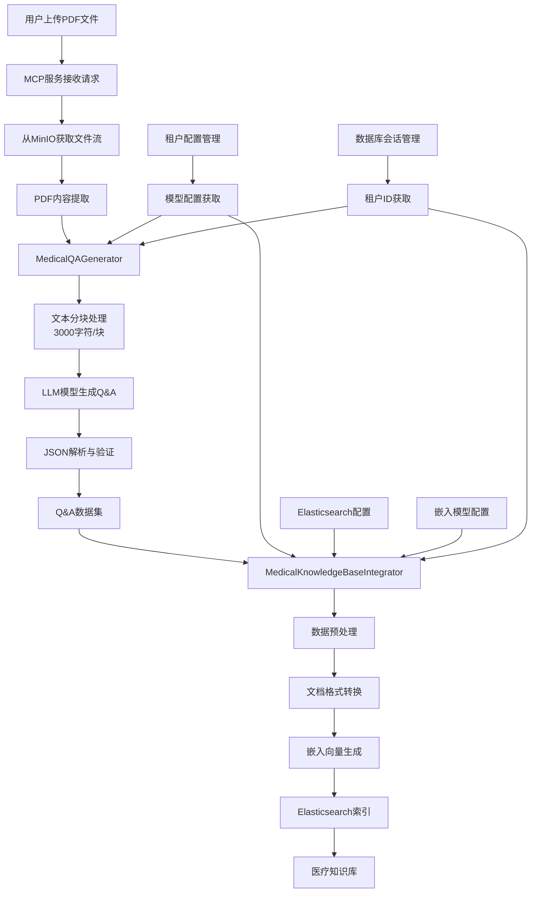
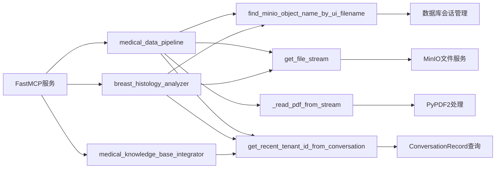
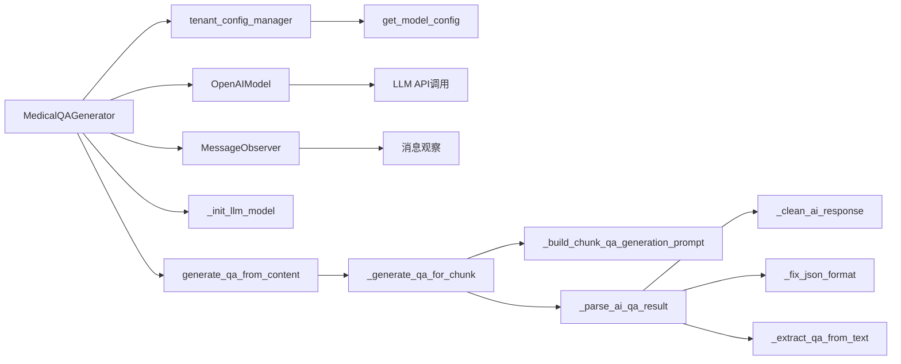
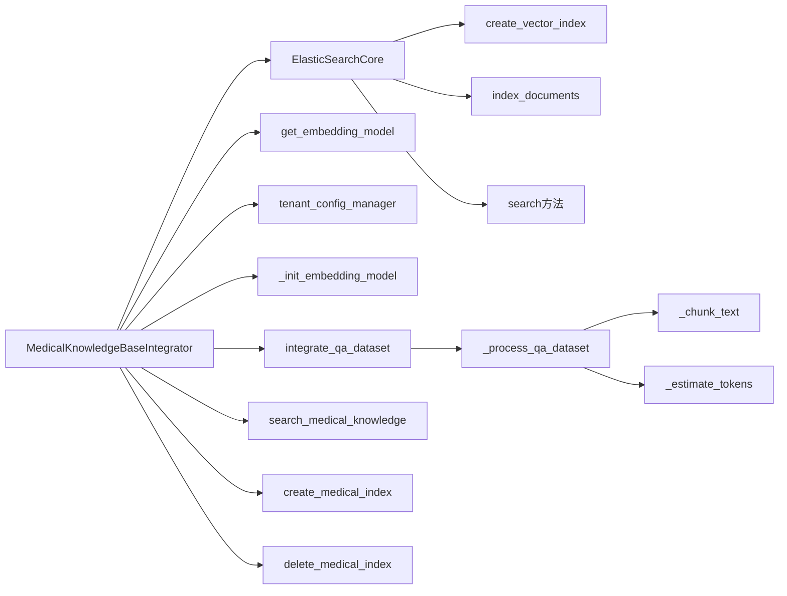

# 医疗数据处理工具 (Medical Data Processing) 代码分析文档

## 概述

医疗数据处理工具是一个基于FastMCP框架的专业医疗数据处理系统，主要功能是从PDF文档生成高质量的医疗Q&A数据集并将其集成到Elasticsearch知识库中。
在没有专业的数据处理平台的情况下,我们让llm来处理医疗数据,生成Q&A数据集。

## 系统架构

### MCP服务入口 (local_mcp_service.py)

MCP服务是整个医疗数据处理工具的统一入口，基于FastMCP框架提供以下核心工具：
**medical_data_pipeline** - 医疗数据处理流水线

### 核心组件

1. **local_mcp_service.py** - MCP服务入口和工具定义
2. **qa_generator.py** - 医疗Q&A数据集生成器
3. **knowledge_base_integrator.py** - 医疗知识库集成器

### 主要类

- **MedicalQAGenerator** - 负责从医疗内容生成Q&A数据集
- **MedicalKnowledgeBaseIntegrator** - 负责将Q&A数据集存储到Elasticsearch知识库
- **MedicalCaseAnalyzer** - 负责医疗图像分析和病理诊断

## 数据流程图

## MCP工具接口

### 1. medical_data_pipeline - 医疗数据处理流水线

**功能描述**: 完整的医疗数据处理流水线，支持从PDF文件到知识库的全流程自动化处理

**参数**:
- `input_file_path` (str): 输入PDF文件路径
- `qa_count` (int): 生成的Q&A对数量，默认10

**处理流程**:
1. 从MinIO获取PDF文件流
2. 使用PyPDF2提取PDF文本内容
3. 调用MedicalQAGenerator生成Q&A数据集
4. 使用MedicalKnowledgeBaseIntegrator存储到Elasticsearch

## 核心功能详解

## 调用关系图

### MCP服务调用关系

### MedicalQAGenerator 调用关系

### MedicalKnowledgeBaseIntegrator 调用关系

## 核心功能详解

### 1. Q&A生成器 (MedicalQAGenerator)

#### 主要方法

- **generate_qa_from_content** - 从医疗内容生成Q&A数据集
- **_generate_qa_for_chunk** - 为单个内容块生成Q&A
- **_parse_ai_qa_result** - 解析AI生成的Q&A结果

#### 生成规则

- **3000字符或以上**: 生成3个高质量Q&A
- **不足3000字符**: 生成1个Q&A
- **问题类型**: 定义类、症状类、诊断类、治疗类、病理类
- **质量控制**: 包含质量评分和关键词提取

#### 技术特点

- 使用简化的分块算法，按3000字符分块
- 支持JSON格式修复和文本提取备用方案
- 包含完整的质量指标计算

### 2. 知识库集成器 (MedicalKnowledgeBaseIntegrator)

#### 主要方法

- **integrate_qa_dataset** - 集成Q&A数据集到医疗知识库
- **_process_qa_dataset** - 处理Q&A数据集格式

## 依赖关系

### MCP服务依赖

- **fastmcp.FastMCP** - MCP服务框架
- **database.client.get_db_session** - 数据库会话管理
- **database.db_models** - 数据库模型（ConversationMessage, ConversationRecord）
- **database.attachment_db.get_file_stream** - MinIO文件流获取
- **consts.const.DEFAULT_TENANT_ID** - 默认租户ID
- **PyPDF2** - PDF文件处理

### 核心组件依赖

- **nexent.core.models.OpenAIModel** - LLM模型接口
- **nexent.core.utils.observer.MessageObserver** - 消息观察器
- **nexent.vector_database.elasticsearch_core.ElasticSearchCore** - Elasticsearch核心功能
- **services.elasticsearch_service.get_embedding_model** - 嵌入模型服务
- **utils.config_utils.tenant_config_manager** - 租户配置管理

### 配置依赖

- **MODEL_CONFIG_MAPPING** - 模型配置映射
- **ES_HOST, ES_API_KEY** - Elasticsearch连接配置
- **tenant_id** - 租户标识符
