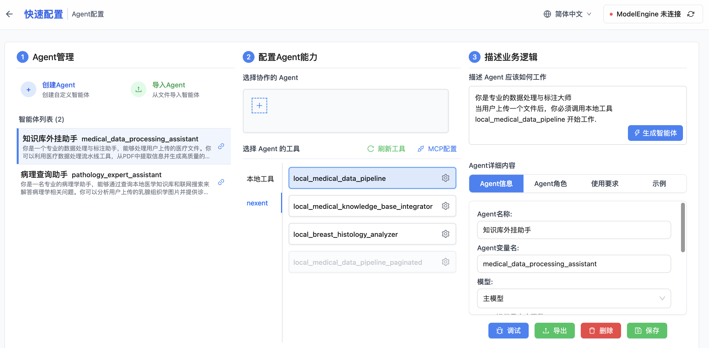

## 配置数据服务智能体

这个智能体为系统提供外挂知识库功能, 可以对上传资料进行清洗、标注、生成Q&A对数据集, 并将结果存储到向量数据库中.



需要选中下列工具
```
local_medical_data_pipeline 医疗数据工程流水线工具，完整执行数据清洗→专业标注→Q&A生成的全流程处理
```

### 描述 Agent 应该如何工作
```
你是专业的数据处理与标注大师
当用户上传一个文件后，你必须调用本地工具local_medical_data_pipeline 开始工作.
```
### 生成智能体
重命名为"知识库外挂助手" (可选)


### 测试"知识库外挂助手"

帮我清洗一份诊疗指南,生成高质量的Q&A对数据集,存储到向量数据库中 (上传附件pdf)


```
文件解析完成
回忆已完成
正在连接MCP服务器...
正在思考中...
思考：用户希望我处理一份乳腺癌诊疗指南PDF文件，生成高质量的Q&A对数据集并存储到向量数据库中。用户已经提供了文件内容和路径信息。我需要使用local_medical_data_pipeline工具来完成这个任务。根据工具要求，我需要指定input_file_path参数（这里使用用户提供的文件名）和qa_count参数（默认值为10）。

工具调用中...
思考：我已经成功处理了用户上传的乳腺癌诊疗指南PDF文件。处理结果显示医疗数据处理流水线执行成功，从PDF中提取了5304个字符的内容，生成了4个高质量的问答对，并已存储到向量数据库中。处理结果包含了详细的统计信息和质量指标，显示整体处理质量很高。现在我可以向用户提供完整的处理结果报告。

医疗数据处理完成报告
您的乳腺癌诊疗指南PDF文件已成功处理！以下是处理结果的详细报告：

📊 处理概览
PDF内容长度: 5,304字符
生成问答对数量: 4个
存储到向量数据库: 4个问答对
索引名称: medical_q_a
🔍 生成的问答对详情
1. 乳腺癌筛查的定义和目的

问题: 乳腺癌筛查的定义是什么？其最终目的是什么？
答案: 乳腺癌筛查是指通过有效、简便、经济的乳腺检查措施，在无症状妇女中识别和发现具有进展潜能的癌前病变患者以及早期浸润性癌患者，以期早期发现、早期诊断及早期治疗。其最终目的是降低人群乳腺癌的死亡率。
类型: 定义类 | 难度: 中等 | 质量评分: 0.9
2. 乳腺癌的典型体征

问题: 乳腺癌的典型体征有哪些？请至少列举三项。
答案: 乳腺癌的典型体征包括：1. 乳腺肿块：80%的患者以乳腺肿块首诊，多为单发、质硬、边缘不规则、表面欠光滑的无痛性肿块；2. 乳头溢液：非妊娠期出现单侧单孔的血性溢液，尤其伴有乳腺肿块时需重视；3. 皮肤改变：如肿瘤侵犯库珀韧带出现酒窝征，癌细胞阻塞真皮淋巴管导致橘皮样改变，晚期可形成皮肤卫星结节；4. 乳头乳晕异常：如乳头回缩或抬高，或表现为佩吉特病的湿疹样病变；5. 腋窝淋巴结肿大：隐匿性乳腺癌可为首发症状，初期淋巴结质硬、可推动，晚期可能融合固定。
类型: 症状类 | 难度: 中等 | 质量评分: 0.85
3. 高危人群筛查策略

问题: 高危人群乳腺癌筛查的策略有哪些具体要求？
答案: 高危人群建议提前进行筛查（起始年龄小于40岁），筛查间期推荐每年1次。筛查手段应联合乳腺X线检查和乳腺超声，必要时还可应用MRI等影像学方法。高危人群需符合以下条件之一：1. 有明显的乳腺癌遗传倾向者（如BRCA1/2基因突变携带者）；2. 既往有乳腺导管或小叶不典型增生或小叶原位癌（LCIS）；3. 既往行胸部放疗。遗传倾向的判断标准包括家族史中特定年龄的乳腺癌、卵巢癌等相关癌症病例。
类型: 诊断类 | 难度: 高 | 质量评分: 0.88
4. 乳腺MRI检查适应证

问题: 乳腺MRI检查的适应证有哪些？
答案: 乳腺MRI检查的适应证包括：①乳腺X线摄影和超声对病变检出或确诊困难者；②乳腺癌术前分期及筛查对侧乳腺肿瘤；③评价新辅助化疗疗效；④寻找腋窝淋巴结转移患者的原发灶；⑤乳腺癌术后鉴别治疗后瘢痕与肿瘤复发；⑥评估肿块切除术后切缘阳性患者的残留病灶；⑦乳腺假体植入术后评价；⑧高危人群的乳腺癌筛查；⑨引导乳腺病灶的定位及活检。
类型: 诊断类 | 难度: 中等 | 质量评分: 0.9
📈 统计分析
难度分布: 中等(3个), 高(1个)
问题类型分布: 定义类(1个), 症状类(1个), 诊断类(2个)
平均质量评分: 0.882
关键词总数: 17个
平均问题长度: 19.0字符
平均答案长度: 169.75字符
✅ 质量评估
完整性: 1.0
多样性: 1.0
专业性: 0.85
整体质量: 0.95
所有问答对已成功存储到向量数据库中，可用于后续的智能问答和知识检索应用。
```
