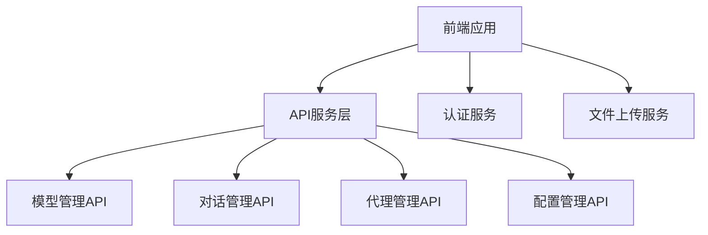
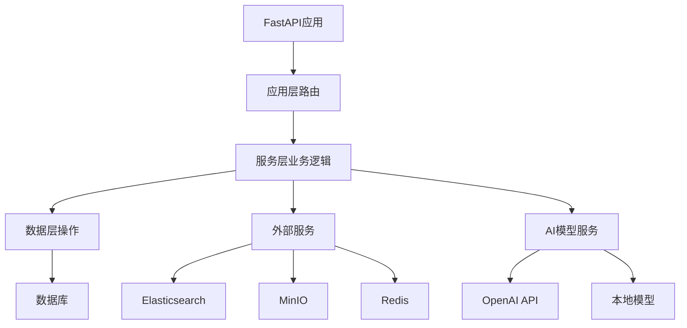
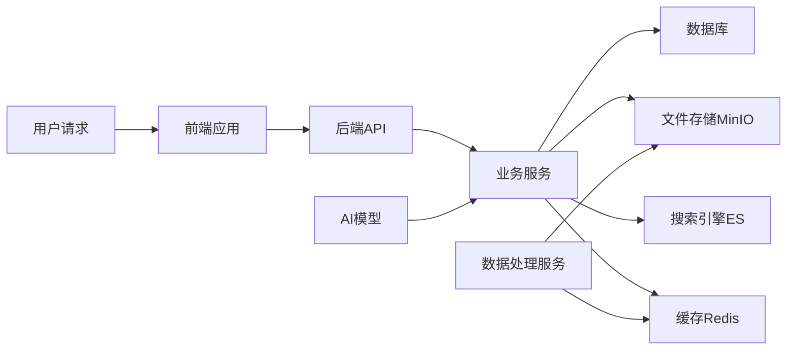
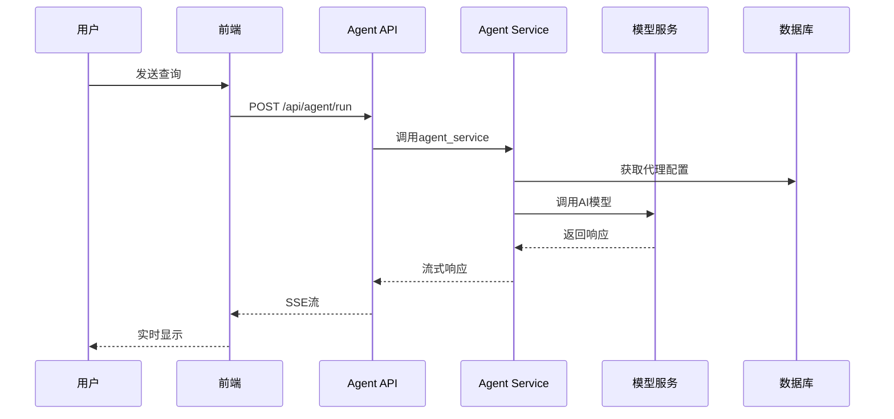
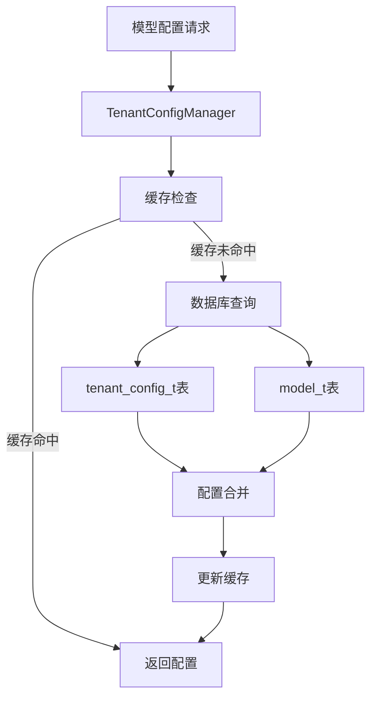
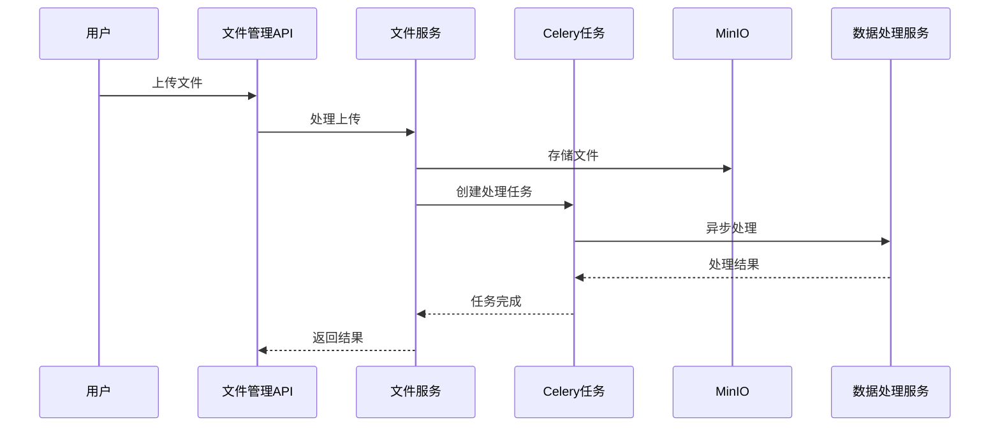
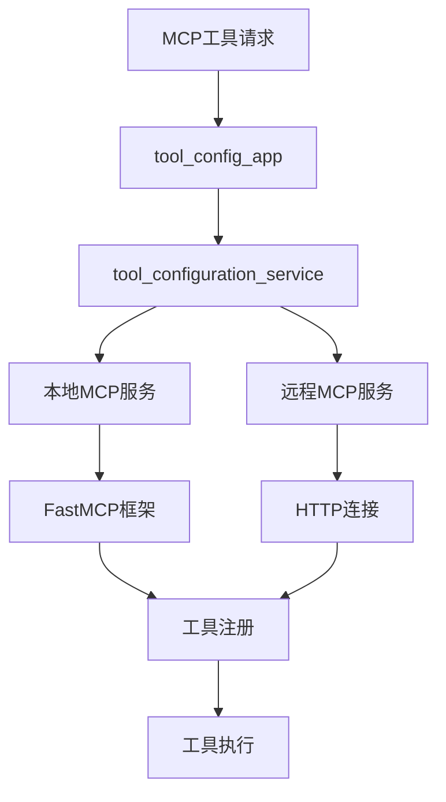

# Nexent 项目架构与依赖关系文档

## 📋 项目概述

Nexent 是一个基于 AI 的智能代理平台，采用微服务架构，支持多租户、多模态 AI 模型集成和工具扩展。项目使用 Docker 容器化部署，提供完整的前后端分离架构。

## 🏗️ 整体架构

### 核心组件

```
┌─────────────────────────────────────────────────────────────┐
│                        Nexent 平台                          │
├─────────────────┬─────────────────┬─────────────────────────┤
│   前端 (Web)    │   后端 (API)    │    数据处理服务         │
│   Next.js       │   FastAPI       │    Celery + Redis       │
│   TypeScript    │   Python        │    异步任务处理         │
│   Ant Design    │   SQLAlchemy    │    文件处理             │
└─────────────────┴─────────────────┴─────────────────────────┘
                           │
┌─────────────────────────────────────────────────────────────┐
│                    基础设施层                                │
├─────────────────┬─────────────────┬─────────────────────────┤
│  PostgreSQL     │  Elasticsearch  │      MinIO              │
│  关系数据库     │  搜索引擎       │    对象存储             │
│  用户/配置数据  │  向量搜索       │    文件存储             │
└─────────────────┴─────────────────┴─────────────────────────┘
```

## 📁 目录结构与模块划分

### 1. 前端模块 (`frontend/`)
- **技术栈**: Next.js + TypeScript + Ant Design
- **主要功能**: 用户界面、模型配置、对话管理、文件上传
- **核心组件**:
  - `app/`: 页面路由和布局
  - `components/`: 可复用UI组件
  - `services/`: API调用服务
  - `types/`: TypeScript类型定义

### 2. 后端核心 (`backend/`)
- **技术栈**: FastAPI + SQLAlchemy + Pydantic
- **架构模式**: 分层架构 (App → Service → Database)

#### 2.1 应用层 (`apps/`)
负责HTTP请求处理和路由分发：

```
apps/
├── base_app.py              # 主应用入口，路由聚合
├── agent_app.py             # AI代理相关API
├── config_sync_app.py       # 配置同步API
├── conversation_management_app.py  # 对话管理API
├── model_managment_app.py   # 模型管理API
├── file_management_app.py   # 文件管理API
├── tool_config_app.py       # 工具配置API
├── user_management_app.py   # 用户管理API
├── northbound_app.py        # 北向接口API
└── ...
```

#### 2.2 服务层 (`services/`)
业务逻辑实现：

```
services/
├── agent_service.py         # AI代理核心逻辑
├── model_management_service.py  # 模型管理服务
├── config_sync_service.py   # 配置同步服务
├── file_management_service.py   # 文件处理服务
├── data_process_service.py  # 数据处理服务
├── northbound_service.py    # 北向接口服务
└── ...
```

#### 2.3 数据层 (`database/`)
数据库操作和模型定义：

```
database/
├── agent_db.py              # 代理数据操作
├── model_management_db.py   # 模型数据操作
├── conversation_db.py       # 对话数据操作
├── user_db.py              # 用户数据操作
└── ...
```

### 3. SDK模块 (`sdk/`)
- **功能**: 提供Python SDK，封装核心功能
- **主要组件**:
  - `nexent/`: 核心SDK包
  - 内存管理、数据处理、模型集成等

### 4. 数据处理服务 (`backend/data_process/`)
- **技术栈**: Celery + Redis
- **功能**: 异步文件处理、图像处理、文本提取
- **核心文件**:
  - `app.py`: Celery应用配置
  - `tasks.py`: 异步任务定义

### 5. 部署配置 (`docker/`)
- **Docker Compose**: 多服务编排
- **部署脚本**: `deploy.sh` 自动化部署
- **配置文件**: 环境变量和服务配置

## 🔗 模块依赖关系

### 1. 前端依赖关系



**关键依赖**:
- `services/api.ts`: 统一API端点定义
- `services/modelService.ts`: 模型配置服务
- `services/userConfigService.ts`: 用户配置服务
- `lib/auth.ts`: 认证工具库

### 2. 后端服务依赖关系



**核心依赖链**:

1. **请求处理链**:
   ```
   HTTP请求 → 应用层(apps/) → 服务层(services/) → 数据层(database/) → 数据库
   ```

2. **AI代理执行链**:
   ```
   agent_app.py → agent_service.py → nexent.core.agents → 模型API
   ```

3. **配置管理链**:
   ```
   config_sync_app.py → config_sync_service.py → tenant_config_manager → 数据库
   ```

### 3. 数据流依赖



## ⚙️ 核心工作机制

### 1. AI代理执行流程



### 2. 模型配置管理



### 3. 文件处理流程



### 4. MCP工具集成



## 🔧 关键技术组件

### 1. 配置管理系统
- **TenantConfigManager**: 多租户配置管理
- **MODEL_CONFIG_MAPPING**: 模型类型映射
- **环境变量**: 系统级配置

### 2. 认证与授权
- **JWT Token**: 用户认证
- **多租户隔离**: 数据安全
- **AKSK认证**: 北向接口安全

### 3. 缓存策略
- **Redis**: 会话缓存、任务队列
- **内存缓存**: 配置缓存、模型缓存
- **数据库连接池**: 性能优化

### 4. 监控与日志
- **监控管理器**: 性能监控
- **结构化日志**: 问题追踪
- **健康检查**: 服务状态监控

## 🚀 部署架构

### 1. 容器化部署

```yaml
# 核心服务容器
services:
  nexent:              # 主应用服务
  nexent-web:          # 前端服务
  nexent-data-process: # 数据处理服务
  
# 基础设施容器
  nexent-postgresql:   # 数据库
  nexent-elasticsearch: # 搜索引擎
  nexent-minio:        # 对象存储
  redis:               # 缓存和消息队列
```

### 2. 部署模式
- **Speed版本**: 轻量级部署，适合个人用户
- **Full版本**: 完整功能，适合企业用户
- **开发模式**: 暴露所有端口，便于调试
- **生产模式**: 仅暴露必要端口，安全优化

### 3. 网络架构
```
Internet → Nginx/Load Balancer → Docker Network
                                      ↓
                              nexent-web:3000 (前端)
                                      ↓
                              nexent:5010 (后端API)
                                      ↓
                              nexent-data-process:5011 (数据处理)
```

## 📊 性能与扩展性

### 1. 水平扩展能力
- **无状态服务**: 支持多实例部署
- **数据库分离**: 支持读写分离
- **缓存层**: Redis集群支持

### 2. 异步处理
- **Celery任务队列**: 文件处理异步化
- **SSE流式响应**: 实时交互体验
- **连接池**: 数据库连接优化

### 3. 资源管理
- **内存管理**: 模型加载优化
- **文件存储**: MinIO分布式存储
- **任务调度**: Celery工作进程管理

## 🔍 开发指南

### 1. 添加新功能模块
1. 在`apps/`创建新的路由文件
2. 在`services/`实现业务逻辑
3. 在`database/`添加数据操作
4. 在`base_app.py`注册路由

### 2. 集成新的AI模型
1. 更新`MODEL_CONFIG_MAPPING`
2. 实现模型适配器
3. 添加健康检查
4. 更新前端配置界面

### 3. 扩展MCP工具
1. 使用`@local_mcp_service.tool`装饰器
2. 定义工具函数和参数
3. 注册到工具配置系统
4. 测试工具集成

---

*本文档基于Nexent v1.0架构编写，随着项目发展会持续更新。*